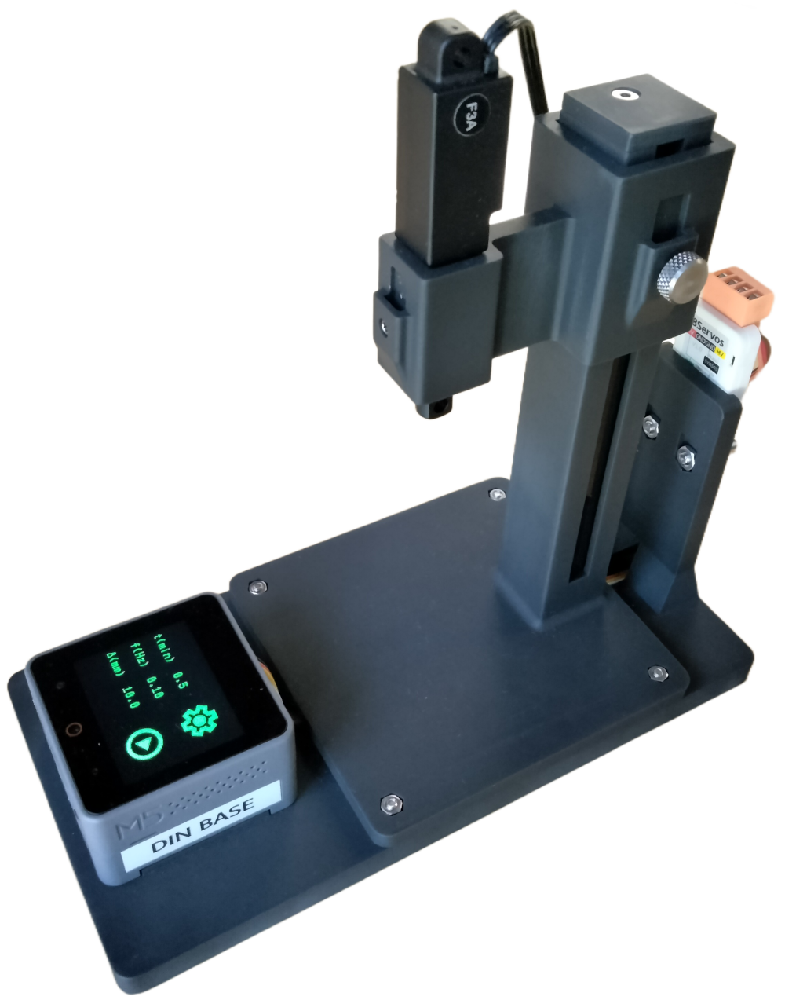
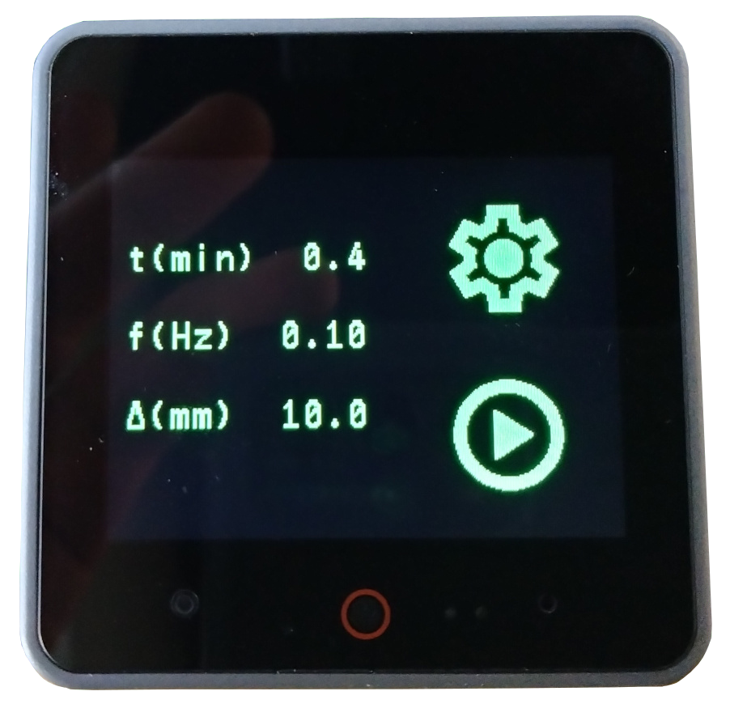

## electrode-etcher-firmware

Micropython firmware for an automated electrode etcher using the 
[M5Stack Core S3](https://shop.m5stack.com/products/m5stack-cores3-esp32s3-lotdevelopment-kit).

The hardware for this project can be found in 
[electode-etcher-hardware](https://github.com/willdickson/electrode-etcher-hardware).







## Requirements

* [adafruit-ampy](https://github.com/scientifichackers/ampy)
* [tio](https://github.com/tio/tio)

Ampy is used for uploading the micropython firmware to the device. Ampy can be
installed using pip via 

```bash
pip install adafruit-ampy
```

or 

```bash
pip install .

```

On Ubuntu/Debian tio can be installed using 

```bash
apt install tio
```

Prior to uploading the firmware the device should be programmed with uiflow2
micropython using [m5burner](https://docs.m5stack.com/en/download) or
esptool.py. The current firmwware was tested on 

> micropython v1.22.0-dirty on 2024-04-11; m5stack cores3 with esp32s3


## Uploading the firmware

An upload script, upload.bash, can be found in the projects source directory. This
script can be used to upload the firmware .py files and the .png files for the icons. 
to the M5State Core S3.

```
usage: ./upload.bash [-i] 

Uploads micropython .py and optionally image .png files to development board using ampy. 
Then connect to the device using tio.


options:
  -i (optional) include image files in upload g files and .py sile
  -c conf, --conf conf  optional configuration file

```


